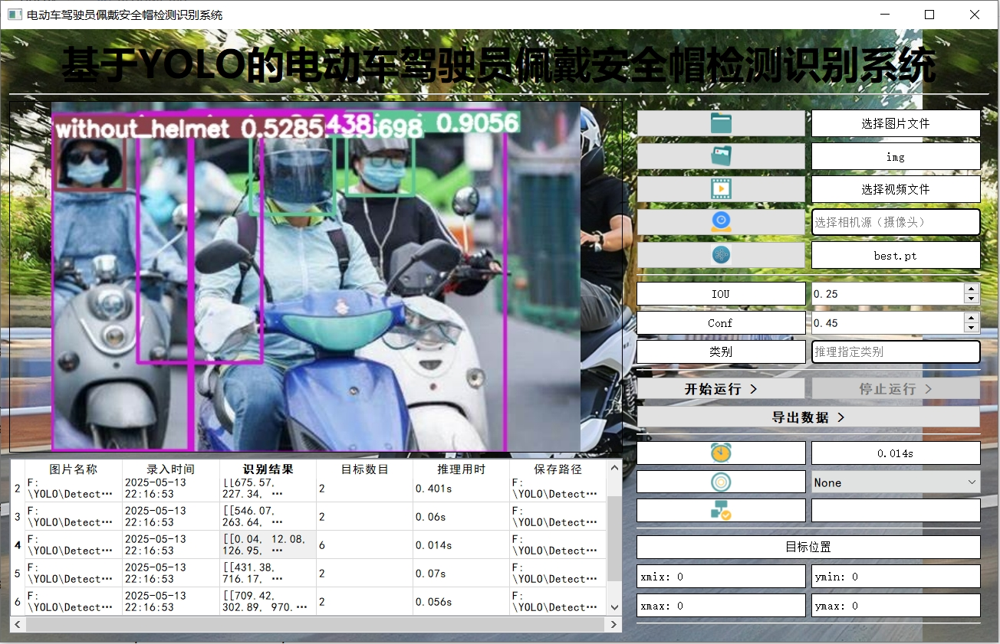
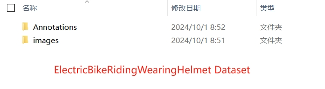
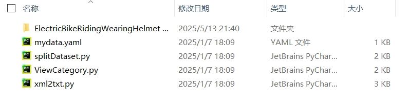

# 基于YOLO的电动车驾驶员佩戴安全帽检测识别系统


## 项目介绍
参考文档          
[【YOLO 系列】基于YOLO V8的电动车驾驶员安全帽佩戴检测识别系统【python源码+Pyqt5界面+数据集+训练代码】](https://mp.weixin.qq.com/s/n7qPWy-OkCwQipZSiWzahg)

## 项目目录
```
| --
    --img                           # 测试图片和视频
    --output                        # 推理结果保存位置
    --runs                          # 模型训练相关文件
    --static                        # 网页相关文件
        --css                       # 布局设置
        --icon                      # 图标
        --js                        # script.js
    --templates                     # 网页界面文件
    --VOCData                       # 数据处理文件夹
        -- mydata.yaml              # 数据配置文件
        -- splitDataset.py          # 划分数据集
        -- ViewCategory.py          # 查看类别
        -- xml2txt.py               # 标注转换
    --weights                       # 预训练权重
    --detect.py                     # 主界面代码
    --GUI.py                        # 界面代码
    --README.md                     # 文档
    --requirements.txt              # 依赖库（不含torch）
    --train.py                      # 训练代码
    --ui.py                         # 界面代码
    --val.py                        # 验证代码
    --web.py                        # 网页代码
```

## 安装库
此环境不包括 torch 的安装，需要自行进行安装，提供 whl 文件下载链接           
[torch](https://download.pytorch.org/whl/torch/)、[torchvision](https://download.pytorch.org/whl/torchvision/)       
[torch 环境配置 从零开始安装 视频](https://www.bilibili.com/video/BV1VS7AztEp4/?share_source=copy_web&vd_source=6b9b90c1308d833a60bc98e28edab705)       

```
pip install -r requirements.txt
```

## 可视化界面
```
python GUI.py
```

## 网页端
```
python web.py
```

## 模型训练
### 数据集格式
数据下载：	
链接: https://pan.baidu.com/s/1IcBVaGst3NQIZJj1PHotUA 
提取码: yuru

1. 将解压的数据集放在 VOCData 文件夹里面； 
2. 运行splitDataset.py，用于划分数据集；
3. 运行xml2txt.py，用于得到训练标注文件；
4. 运行ViewCategory.py，用于查看一共有那些类别；

### 训练
```
python train.py
```

## 验证
```
python val.py
```

## 推理
```
python detect.py
```

## 项目相关问题
问题：运行GUI.py，且填写相关内容后，依然推理失败    
解决：请查看下述图片，【weights：选./runs/detect/train/weights/best.pt里面的】


问题：数据集在哪里       
解决：提供了下载链接，进行下载，如果出现任何问题，就请换一个解压软件。【[推荐（bandizip）](https://www.bandisoft.com/bandizip/)】  



问题：数据集处理不来，有问题      
解决：该问题自行解决，在上述给出了流程的

问题：如何修改UI文件里面的字体和内容     
解决：在ui.py文件中进行修改

问题：摄像头如何使用
解决：摄像头图标右边可以输出，再这里输入0或视频流地址，然后点击摄像头图片，最后再点击开始运行

## 联系作者
WX公众号：@AI算法与电子竞赛